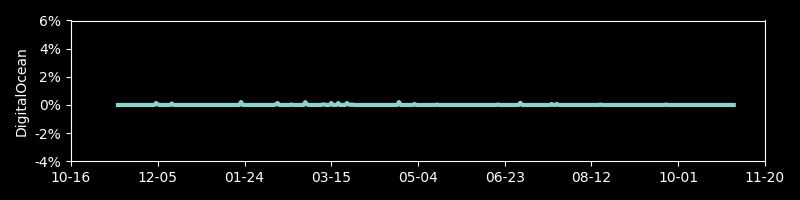

# Track IPs for Cloud Providers

A repo to track the relative size, in terms of IP addresses, for different cloud providers.

Currently, the cloud providers have this many IPv4 addresses:

Over time, each item's size

 
 
 
 
 
 

An IP map, in the style of [XKCD's map of the Internet](https://xkcd.com/195/), of the big providers:

