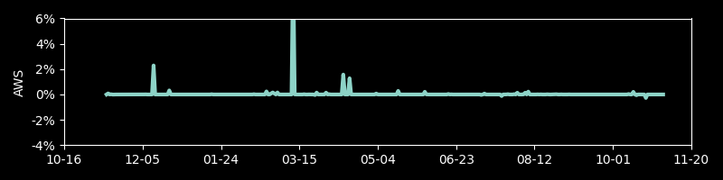
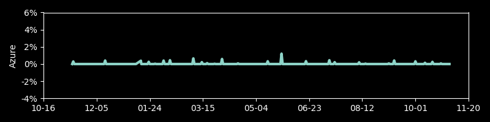
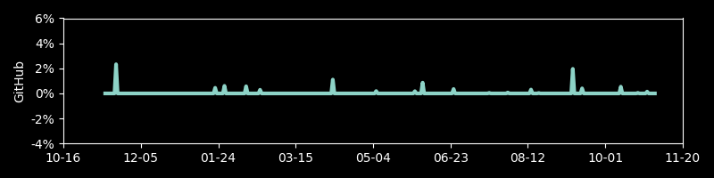
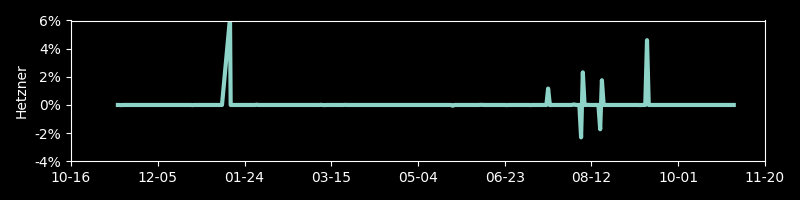
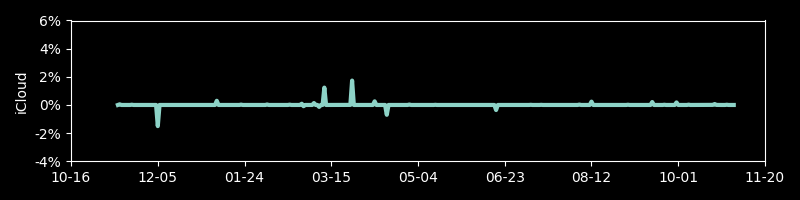
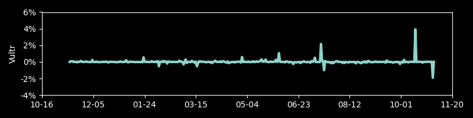

# Track IPs for Cloud Providers

A repo to track the relative size, in terms of IP addresses, for different services using relatively large IPv4 pools, such as cloud providers.

Currently, they providers have this many IPv4 addresses, shown with a logarithmic scale:

Over time, each item's day to day change in percent:

 
 
 
 
 
 
 
 
 
 
 
 

An IP map of the big providers, in the style of [XKCD's map of the Internet](https://xkcd.com/195/):

