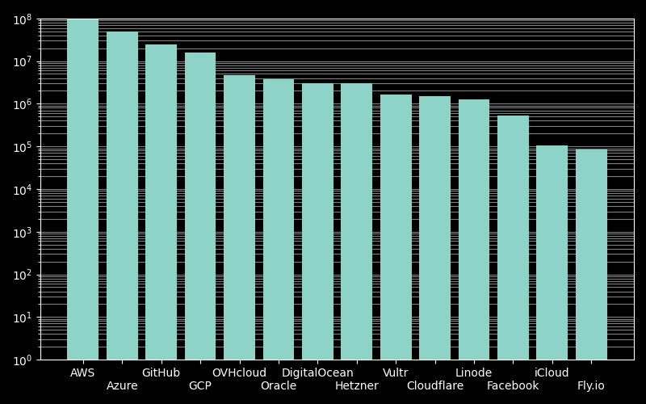
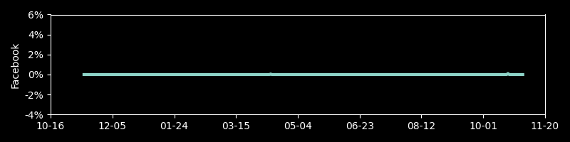
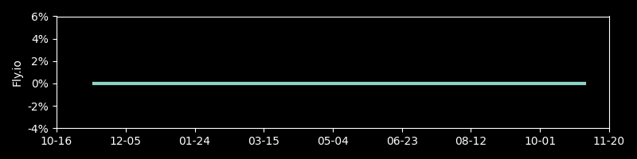
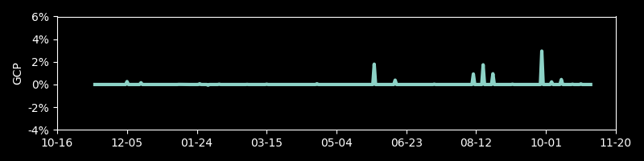
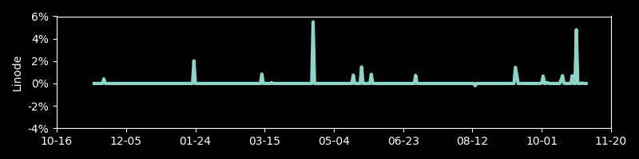
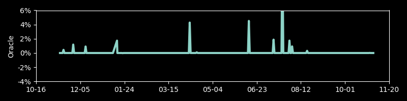
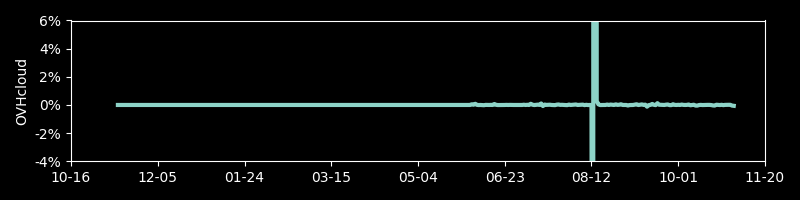

# Track IPs for Cloud Providers

A repo to track the relative size, in terms of IP addresses, for different services using relatively large IPv4 pools, such as cloud providers.
If you want to look up an IP address, you can see if it's from any of the cloud providers using [this tool](https://cloud-ips.s3-us-west-2.amazonaws.com/index.html) or using [this Python script](https://github.com/seligman/cloud_sizes/blob/master/cloud_db/lookup_ip_address.py).

To get a daily update of the counts:

Currently, the providers have this many IPv4 addresses, shown here with a logarithmic scale:

Over time, each item's day to day change in percent:

 
 
 
 
 
 
 
 
 
 
 
 
 
 

An IP map of the big providers, in the style of [XKCD's map of the Internet](https://xkcd.com/195/):

### Remote write to Mimir

~~~shell
source venv/bin/activate
protoc prometheus.proto --python_out=.
export MIMIR_URL=""
export MIMIR_USERNAME=""
export MIMIR_PASSWORD=""
export FULL_EXPORT=false #true
python mimir_remote_writer.py 
~~~
